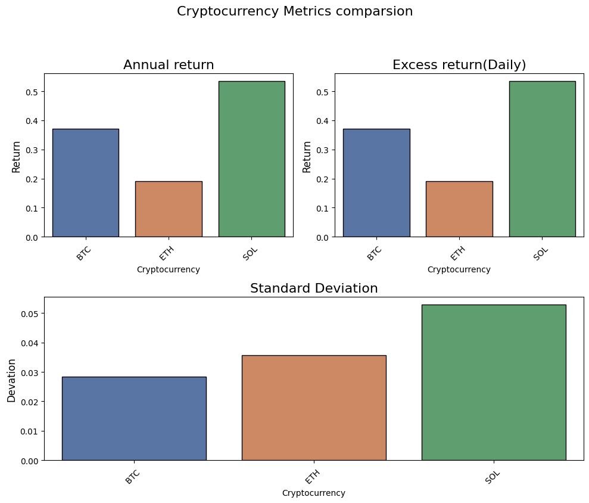

# 📊 Crypto Metrics  

A data analytics project for tracking and visualizing cryptocurrency metrics such as daily returns and performance comparisons across Bitcoin, Ethereum, Solana.

---

## 🚀 Features  
- Compute **daily returns** for multiple cryptocurrencies.  
- Compare performance between assets (BTC, ETH, SOL).  
- SQL queries & Python notebooks for reproducible analysis.  
- Simple, clear visualizations.  
- Easily extendable for more tokens and metrics.  

---

## ⚙️ Tools used
- **Python**(matplotlib, pandas, gridspec, seaborn)
- **yfinance**
- **Google colab**
- **Excel**

## 📈 Insights
- **Solana(SOL)** has the biggest **Annual** and **Excess** return - *53%*
- **Ethereum(ETH)** in its way has the opposite - the **worst** returns - *19%*
- **Bitcoin** has the smallest standard deviation -*0.02*, Meanwhile **Solana** has the lead again - *0,05*

- ## 🖼 Preview
- 
